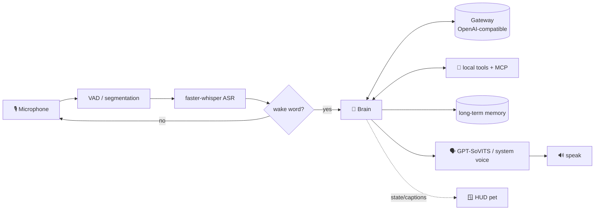

<div align="center">

# 🤖 Jarvis-Mac

**A Chinese voice butler for your Mac — just say "Jarvis" and it gets things done.**

Local speech recognition · any LLM (via your own gateway / DeepSeek / GPT…) · tool calling · cloned voice · Iron-Man-style holographic desk pet

[](https://www.python.org/)
[](#-quick-start)
[](./LICENSE)

[简体中文](./README.md) · **English**


<sub>Demo: say "Jarvis" → listen → think → reply in a cloned voice; the HUD arc reactor shifts color by state</sub>

</div>

---

## ✨ What is this

Jarvis-Mac is a **Chinese-language voice assistant** for **macOS / Windows**, inspired by Iron Man's AI butler.
Say "Jarvis" to your computer and it wakes up, listens, understands what you want, calls tools to do it,
and answers you by voice — while a cyan holographic console pet floats on your desktop showing the time,
system telemetry, and live conversation captions.

> 🪟 It started as a macOS project (hence the repo name `jarvis-mac`) and is now **cross-platform from a single codebase**:
> platform-specific bits (speech synthesis, screenshots, clipboard, media/volume, recycle bin, telemetry…) switch automatically, centralized in `jarvis/winops.py`.

Its brain talks to an **OpenAI-compatible API**, so you can plug in **any model through your own gateway**
(DeepSeek, GPT, Claude…) and switch on demand. Its voice can optionally use **GPT-SoVITS** to speak in a cloned voice.

> 💡 A personal project for tinkerers who want a desktop voice assistant that is *local-first* and *gets to know you over time*.

## 🌟 Features

- 🎙️ **Local speech recognition** — transcribed on-device with [faster-whisper](https://github.com/SYSTRAN/faster-whisper); your audio never leaves your machine.
- 🔑 **Fuzzy pinyin wake word** — say "贾维斯" (Jarvis); homophone mis-hearings still match, with noise/hallucination filtering so the TV won't trigger it.
- 🧠 **Any LLM** — connect DeepSeek / GPT / Claude etc. through your OpenAI-compatible gateway; change one line to swap models.
- 🧰 **17 built-in tools + MCP** — open apps, check weather, control music, read the screen, send WeChat messages, tidy files, set timers… and extend further via [MCP](https://modelcontextprotocol.io/).
- 🗣️ **Cloned voice** — optionally connect [GPT-SoVITS](https://github.com/RVC-Boss/GPT-SoVITS) to speak in a cloned voice; falls back to the system `say` voice if the service is offline.
- 🧬 **Long-term memory** — tell it "remember…" and it keeps your name, preferences, and habits across restarts.
- 🪟 **Holographic HUD pet** — an Iron-Man-style cyan console: an arc reactor that changes color by state, clock & weather, disk/battery/CPU telemetry, conversation captions, and a notes panel. Click the reactor to talk.
- 🔒 **Local-first** — recognition, the pet, and memory all run locally; the LLM goes through *your* gateway, and all secrets stay on your machine, never in the repo.

## 🧱 Architecture



| Module | Files | Role |
|---|---|---|
| Main loop | `jarvis/__main__.py` | Wake word, state machine, wiring |
| Recognition | `jarvis/asr.py` `jarvis/audio.py` | Microphone + faster-whisper |
| Brain | `jarvis/brain.py` | Gateway calls, tool-calling loop, multi-step tasks |
| Tools | `jarvis/tools.py` `jarvis/mcp_bridge.py` | Local tools + MCP tools |
| Memory | `jarvis/memory.py` | Persisted to `memory.json` |
| Voice | `jarvis/tts.py` | GPT-SoVITS cloned voice / system voice (say · SAPI) |
| Pet | `jarvis/pet.py` | Holographic HUD (tkinter + Pillow) |
| Platform | `jarvis/winops.py` | Windows low-level ops (clipboard/media/screenshot/recycle/telemetry…) |
| Config | `jarvis/config.py` | Central configuration |

## 🚀 Quick start

> Requires **Python 3.12** (macOS or Windows). The first run downloads the Whisper model — please be patient.

<details open>
<summary><b>🍎 macOS</b></summary>

```bash
# 1) Clone
git clone https://github.com/wqq64842-commits/jarvis-mac.git
cd jarvis-mac

# 2) Create a venv and install deps
python3.12 -m venv .venv
source .venv/bin/activate
pip install -r requirements.txt

# 3) Configure your gateway (OpenAI-compatible)
cp base_url.txt.example base_url.txt   # your gateway URL, e.g. https://xxx/v1
cp api_key.txt.example  api_key.txt    # your API key
cp model.txt.example    model.txt      # pick a model, e.g. deepseek-chat

# 4) Run (with the desk pet)
./run.sh
# or headless: ./run.sh --no-pet
```

> ⚠️ On first run macOS asks for **Microphone** permission; some tools (screenshot / read-screen / WeChat)
> also need **Screen Recording** and **Accessibility** permission under *System Settings → Privacy & Security*.
</details>

<details>
<summary><b>🪟 Windows (PowerShell)</b></summary>

```powershell
# 1) Clone
git clone https://github.com/wqq64842-commits/jarvis-mac.git
cd jarvis-mac

# 2) Create a venv and install deps
py -3.12 -m venv .venv
.\.venv\Scripts\Activate.ps1
pip install -r requirements.txt

# 3) Configure your gateway (OpenAI-compatible)
copy base_url.txt.example base_url.txt   # your gateway URL, e.g. https://xxx/v1
copy api_key.txt.example  api_key.txt    # your API key
copy model.txt.example    model.txt      # pick a model, e.g. deepseek-chat

# 4) Run (with the desk pet)
.\run.bat
# or headless: .\run.bat --no-pet
```

> ⚠️ On Windows, allow **Microphone** access on first run (Settings → Privacy & security → Microphone).
> The system voice uses built-in **SAPI** — install a Chinese voice (e.g. *Microsoft Huihui*) under
> *Time & language → Speech*. WeChat sending uses UI automation, so WeChat must be logged in and focusable.
</details>

Then say "**贾维斯**" (Jarvis), or click the arc reactor at the center of the pet, to start talking.

### 🗣️ (Optional) Cloned voice

By default it speaks with the system Chinese voice (macOS `say` / Windows SAPI) — zero config. For a cloned voice:

1. Deploy [GPT-SoVITS](https://github.com/RVC-Boss/GPT-SoVITS) and start its `api_v2` listening on `127.0.0.1:9880`;
2. Prepare a few-second reference clip of the voice you want, and set:
   ```bash
   export JARVIS_TTS=gptsovits
   export GPTSOVITS_REF=/abs/path/to/your_reference.wav
   export GPTSOVITS_PROMPT="the exact text spoken in that reference clip"
   ```
3. Re-run `./run.sh`. If port 9880 is unreachable it auto-falls back to `say`.

> 💡 On Apple Silicon, set GPT-SoVITS `device` to `mps` for GPU acceleration — 2–3× faster synthesis.

## ⚙️ Configuration

All sensitive config lives in a few text files in the project root (excluded by `.gitignore`, never committed):

| File | Purpose | Required |
|---|---|---|
| `base_url.txt` | Gateway URL (ending in `/v1`) | ✅ |
| `api_key.txt` | Gateway / LLM API key | ✅ |
| `model.txt` | Model name (default `deepseek-chat`) | ⬜ |
| `mcp.json` | MCP tool config | ⬜ |
| `notes.txt` | HUD notes panel content | ⬜ |

Environment variables override these (higher priority): `JARVIS_BASE_URL`, `JARVIS_API_KEY`, `JARVIS_MODEL`,
`JARVIS_TTS`, `JARVIS_VOICE`, `JARVIS_WHISPER`, etc. — see `jarvis/config.py`.

> 🔧 **Switch models**: edit one line in `model.txt` and restart. Pick a model that **supports tool calling**,
> otherwise opening apps / reading the screen / memory won't work.

## 🧰 Built-in tools

| Tool | Description |
|---|---|
| `open_app` / `open_url` / `web_search` | Open apps, URLs, search |
| `get_time` / `get_weather` | Time, weather |
| `control_music` / `set_volume` | Control Music, adjust volume |
| `set_timer` | Countdown voice reminder |
| `take_screenshot` / `read_screen` | Screenshot, read & summarize the screen |
| `send_wechat` | Send a WeChat message (confirms verbally first; macOS / Windows) |
| `system_power` | Lock / sleep |
| `remember` / `forget` | Long-term memory add/remove |
| `list_directory` / `run_shell` / `move_to_trash` | Multi-step file tasks (deletes go to Trash) |

## 🔌 MCP extensions

Edit `mcp.json` to connect [MCP](https://modelcontextprotocol.io/) servers (filesystem, browser automation, web fetch, …);
a filesystem example ships with the repo. MCP tools are offered to the LLM alongside the built-in tools.

## 🗺️ Roadmap

- [x] Windows support (cross-platform from a single codebase)
- [ ] Launch at login (macOS launchd / Windows Task Scheduler)
- [ ] Click-through / adjustable opacity for the pet
- [ ] More built-in tools (Calendar, Reminders, Mail)
- [ ] Waveform driven by real mic levels

Issues and PRs welcome — see the [Contributing Guide](./CONTRIBUTING.md).

## 🙏 Acknowledgements

- [GPT-SoVITS](https://github.com/RVC-Boss/GPT-SoVITS) — few-shot voice cloning
- [faster-whisper](https://github.com/SYSTRAN/faster-whisper) — local speech recognition
- [Model Context Protocol](https://modelcontextprotocol.io/) — tool extension protocol
- [skyfireitdiy/Jarvis](https://github.com/skyfireitdiy/Jarvis) — same-name project, README style reference

## 📄 License

[MIT](./LICENSE) © 2026 wang64862
