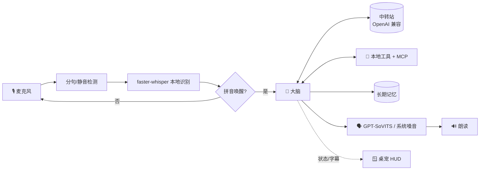

<div align="center">

# 🤖 Jarvis-Mac

**你电脑上的中文语音管家 —— 喊一声「贾维斯」，动口就办事。**

本地语音识别 · 任意大模型（中转站/DeepSeek/GPT…）· 工具调用 · 克隆音发声 · 钢铁侠风格全息桌宠

[](https://www.python.org/)
[](#-快速开始)
[](./LICENSE)

**简体中文** · [English](./README.en.md)


<sub>演示：喊「贾维斯」→ 聆听 → 思考 → 用克隆音回答，HUD 反应堆随状态变色</sub>

</div>

---

## ✨ 这是什么

Jarvis-Mac 是一个跑在 **macOS / Windows** 上的**中文语音助手**，灵感来自电影里钢铁侠的 AI 管家。
你对着电脑喊「贾维斯」，它就醒来听你说话、理解意图、调用工具把事办了，再用语音回答你——
桌面上还浮着一块青色的全息控制台桌宠，实时显示时间、系统状态和对话字幕。

> 🪟 项目最初为 macOS 而生（仓库名 `jarvis-mac`），现已**同一套代码跨平台**支持 Windows：
> 底层差异（语音合成、截屏、剪贴板、媒体/音量、回收站、系统遥测等）按系统自动切换，集中在 `jarvis/winops.py`。

它的大脑接的是 **OpenAI 兼容接口**，所以你可以用**自己的中转站**接入任意模型
（DeepSeek、GPT、Claude……），按需切换；嗓音可选接入 **GPT-SoVITS 克隆音**，让它用你想要的声音说话。

> 💡 这是一个个人项目，面向喜欢折腾、想要一个「本地可控、越用越懂你」的桌面语音助手的玩家。

## 🌟 特性

- 🎙️ **本地语音识别** —— 用 [faster-whisper](https://github.com/SYSTRAN/faster-whisper) 在本地转写，不上传你的声音。
- 🔑 **拼音模糊唤醒** —— 喊「贾维斯」即可唤醒，识别成「家维斯/贾卫师」等同音也能命中；并做了噪音幻听过滤，防止电视声误唤醒。
- 🧠 **任意大模型** —— 通过你的中转站（OpenAI 兼容）接入 DeepSeek / GPT / Claude 等，改一行配置即可换模型。
- 🧰 **17 个内置工具 + MCP 扩展** —— 开应用、查天气、控制音乐、读屏幕、发微信、整理文件、设倒计时…… 还能通过 [MCP](https://modelcontextprotocol.io/) 接入更多能力。
- 🗣️ **克隆音发声** —— 可选接入 [GPT-SoVITS](https://github.com/RVC-Boss/GPT-SoVITS)，用克隆嗓音朗读；服务没开时自动回退到系统 `say`。
- 🧬 **长期记忆** —— 说「记住…」它就跨重启记住你的名字、偏好、习惯，越用越懂你。
- 🪟 **全息桌宠 HUD** —— 钢铁侠风格的青色控制台：弧形反应堆随状态变色、时钟天气、磁盘/电量/CPU 遥测、对话字幕、笔记栏。点反应堆即可说话。
- 🔒 **本地可控** —— 识别、桌宠、记忆都在本地；大模型走你自己的中转站，密钥配置全部留在本机、不进仓库。

## 🧱 架构



| 模块 | 文件 | 职责 |
|---|---|---|
| 主循环 | `jarvis/__main__.py` | 唤醒、状态机、把各模块串起来 |
| 识别 | `jarvis/asr.py` `jarvis/audio.py` | 麦克风 + faster-whisper |
| 大脑 | `jarvis/brain.py` | 调中转站、工具调用循环、多步任务 |
| 工具 | `jarvis/tools.py` `jarvis/mcp_bridge.py` | 本地工具 + MCP 工具 |
| 记忆 | `jarvis/memory.py` | 持久化到 `memory.json` |
| 发声 | `jarvis/tts.py` | GPT-SoVITS 克隆音 / 系统嗓音（say · SAPI）|
| 桌宠 | `jarvis/pet.py` | 全息 HUD（tkinter + Pillow）|
| 平台 | `jarvis/winops.py` | Windows 底层操作（剪贴板/媒体/截屏/回收站/遥测…）|
| 配置 | `jarvis/config.py` | 集中读取各项配置 |

## 🚀 快速开始

> 需要 **Python 3.12**（macOS 或 Windows 均可）。首次运行会下载 Whisper 模型，请耐心等待。

<details open>
<summary><b>🍎 macOS</b></summary>

```bash
# 1) 克隆
git clone https://github.com/wqq64842-commits/jarvis-mac.git
cd jarvis-mac

# 2) 建虚拟环境并装依赖
python3.12 -m venv .venv
source .venv/bin/activate
pip install -r requirements.txt

# 3) 配置中转站（OpenAI 兼容网关）
cp base_url.txt.example base_url.txt   # 填你的中转站地址，如 https://xxx/v1
cp api_key.txt.example  api_key.txt    # 填你的 API Key
cp model.txt.example    model.txt      # 选模型，如 deepseek-chat

# 4) 启动（带桌宠）
./run.sh
# 或纯命令行：./run.sh --no-pet
```

> ⚠️ 首次运行 macOS 会弹窗申请**麦克风**权限；部分工具（截屏/读屏/发微信）还需要在
> 「系统设置 → 隐私与安全性」里授予**屏幕录制**、**辅助功能**权限。
</details>

<details>
<summary><b>🪟 Windows（PowerShell）</b></summary>

```powershell
# 1) 克隆
git clone https://github.com/wqq64842-commits/jarvis-mac.git
cd jarvis-mac

# 2) 建虚拟环境并装依赖
py -3.12 -m venv .venv
.\.venv\Scripts\Activate.ps1
pip install -r requirements.txt

# 3) 配置中转站（OpenAI 兼容网关）
copy base_url.txt.example base_url.txt   # 填你的中转站地址，如 https://xxx/v1
copy api_key.txt.example  api_key.txt    # 填你的 API Key
copy model.txt.example    model.txt      # 选模型，如 deepseek-chat

# 4) 启动（带桌宠）
.\run.bat
# 或纯命令行：.\run.bat --no-pet
```

> ⚠️ Windows 上首次运行会申请**麦克风**权限（设置 → 隐私与安全性 → 麦克风，允许桌面应用访问）。
> 系统嗓音用内置 **SAPI**（建议在「时间和语言 → 语音」里装一个中文语音，如 *Microsoft Huihui*）；
> 发微信靠 UI 自动化，需微信已登录、能被前台唤起。
</details>

启动后喊一声「**贾维斯**」，或用鼠标点一下桌宠中央的反应堆，就能开始对话。

### 🗣️（可选）接入克隆音

默认用系统中文音 `say` 发声，零配置即可用。想要克隆嗓音：

1. 按 [GPT-SoVITS](https://github.com/RVC-Boss/GPT-SoVITS) 文档部署，启动它的 `api_v2`，监听 `127.0.0.1:9880`；
2. 准备一段参考音频（几秒你想要的嗓音），设置环境变量：
   ```bash
   export JARVIS_TTS=gptsovits
   export GPTSOVITS_REF=/绝对路径/你的参考音频.wav
   export GPTSOVITS_PROMPT="参考音频里说的那句话"
   ```
3. 重新 `./run.sh`。连不上 9880 时会自动回退到 `say`，不影响使用。

> 💡 Apple 芯片可把 GPT-SoVITS 的 `device` 设为 `mps` 用 GPU 加速，合成快 2~3 倍。

## ⚙️ 配置说明

所有敏感配置都放在项目根目录的几个文本文件里（已被 `.gitignore` 排除，不会进仓库）：

| 文件 | 作用 | 必填 |
|---|---|---|
| `base_url.txt` | 中转站地址（填到 `/v1`） | ✅ |
| `api_key.txt` | 中转站 / LLM 的 API Key | ✅ |
| `model.txt` | 模型名（默认 `deepseek-chat`） | ⬜ |
| `mcp.json` | MCP 工具配置 | ⬜ |
| `notes.txt` | HUD 笔记栏内容 | ⬜ |

也支持用环境变量覆盖（优先级更高）：`JARVIS_BASE_URL`、`JARVIS_API_KEY`、`JARVIS_MODEL`、
`JARVIS_TTS`、`JARVIS_VOICE`、`JARVIS_WHISPER` 等，详见 `jarvis/config.py`。

> 🔧 **换模型**：改 `model.txt` 一行，重启即可。建议选**支持工具调用**的模型，
> 否则开应用/读屏幕/记忆等能力会失效。

## 🧰 内置工具

| 工具 | 说明 |
|---|---|
| `open_app` / `open_url` / `web_search` | 打开应用、网址、搜索 |
| `get_time` / `get_weather` | 报时、查天气 |
| `control_music` / `set_volume` | 控制 Music、调音量 |
| `set_timer` | 倒计时语音提醒 |
| `take_screenshot` / `read_screen` | 截屏、看屏幕内容并总结 |
| `send_wechat` | 微信发消息（发送前会先口头确认；macOS / Windows 均支持） |
| `system_power` | 锁屏 / 休眠 |
| `remember` / `forget` | 长期记忆增删 |
| `list_directory` / `run_shell` / `move_to_trash` | 多步文件任务（删除走废纸篓，更安全） |

## 🔌 MCP 扩展

编辑 `mcp.json` 即可接入 [MCP](https://modelcontextprotocol.io/) 服务器（文件系统、浏览器自动化、网页抓取等），
仓库内已带文件系统示例。MCP 工具会和内置工具一起交给大模型自由调用。

## 🗺️ 路线图

- [x] Windows 支持（同一套代码跨平台）
- [ ] 开机自启（macOS launchd / Windows 计划任务）
- [ ] 桌宠点击穿透 / 可调透明度
- [ ] 更多内置工具（日历、提醒事项、邮件）
- [ ] 真实麦克风电平驱动波形

欢迎 Issue / PR 一起折腾，详见 [贡献指南](./CONTRIBUTING.md)。

## 🙏 致谢

- [GPT-SoVITS](https://github.com/RVC-Boss/GPT-SoVITS) —— 少样本克隆音
- [faster-whisper](https://github.com/SYSTRAN/faster-whisper) —— 本地语音识别
- [Model Context Protocol](https://modelcontextprotocol.io/) —— 工具扩展协议
- [skyfireitdiy/Jarvis](https://github.com/skyfireitdiy/Jarvis) —— 同名项目，README 形态参考

## 📄 License

[MIT](./LICENSE) © 2026 wang64862
